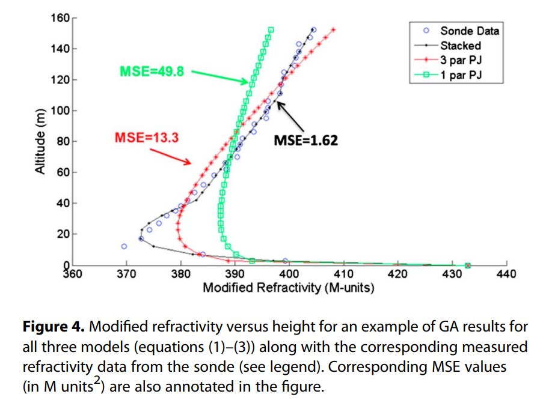
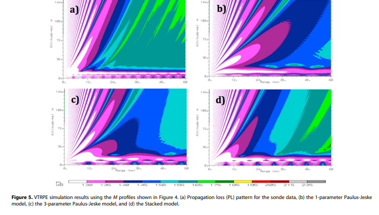
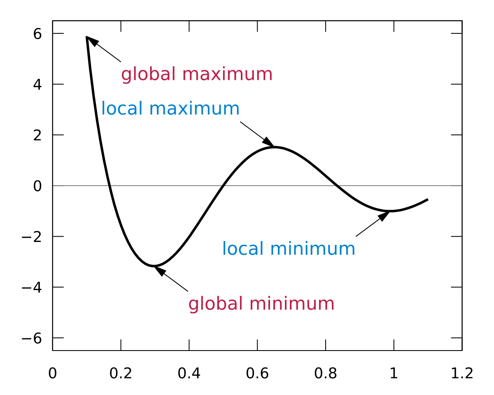

```{r setup, include=FALSE}
knitr::opts_chunk$set(echo = FALSE,message = FALSE,warning=FALSE)

xaringanExtra::use_xaringan_extra(c("tile_view","clipboard","tachyons"))

xaringanExtra::use_extra_styles(
  hover_code_line = TRUE,       
  mute_unhighlighted_code = TRUE  
)

```

# Quick Aside

## I made this presentation using the xaringan package in Rmarkdown. The code is up on gauchospace if you want to see more ways Rmarkdown can be used beyond just homework assignments. 

.pull-left[

.bold[Pros:]

- Easily integrate R code

- Update figures automatically

- Living presentation with html features

- Easier to write math through Latex and MathJax
]

.pull-right[

.bold[Cons:]

- Define everything in code, no easy powerpoint tools

- Maybe not as "sexy" as other presentations
]

---

# Packages to follow along with

.chuge[
```{r loadds, echo=TRUE}
library(tidyverse)
remotes::install_github("lter/lterdatasampler")
library(lterdatasampler)
library(knitr)
library(broom)
library(investr)
library(kableExtra)
```
]

---
class: title-slide-section-gold, center, middle

# What is Non-linear Least Squares?

---

# Remember what OLS does first

## Fundamental objective of Ordinary Least Squares regression:

.pull-left[

```{r mtcars,fig.dim = c(6, 4),fig.align='center'}
fit<-lm(mpg~hp,data=mtcars)

d<-mtcars
d$predicted<-predict(fit)
d$residuals<-residuals(fit)

ggplot(d,aes(x=hp,y=mpg))+
  geom_point(size=4)+
  theme_bw()+
  theme(axis.title = element_text(size=28),axis.text = element_text(size=20))
  
```

]

--

.pull-right[

### - Best fit a line to data

{{content}}

]

--

### - How does OLS fit the line?

Hint: $\hat{\beta}=\frac{\sum^n_{i=1}(x_i-\bar{x})(y_i-\bar{y})}{\sum^n_{i=1}(x_i-\bar{x})^2}$


{{content}}

---

# Remember what OLS does first

##.white[blank]

.pull-left[
```{r, fig.dim = c(6, 4),fig.align='center'}
ggplot(d,aes(x=hp,y=mpg))+
  geom_smooth(method = "lm",se=FALSE,color="blue")+geom_segment(aes(xend=hp,yend=predicted),alpha=.2)+
  geom_point(size=4)+
  geom_point(aes(y=predicted),size=4,shape=1)+
  theme_bw()+
  theme(axis.title = element_text(size=28),axis.text = element_text(size=20))
```

]
.pull-right[### How does OLS fit the line?

 - Minimize squared error (aka residuals)

$\hat\beta=\min_\beta \sum^n_{i=1}\hat{\epsilon_i}^2=\sum^n_{i=1}(y_i-\beta x_i)^2$

]

---

# OLS is simple and powerful, but has limitations

## Linear relationship between predictor (y) and variables (x)

## Last week we started branching away from strictly linear models with logistic regressions 

## But the link functions typically still maintain a linear form

.mbig[
$$
\ln(\frac{p}{1-p})=\beta_0+\beta_1x_1+\beta_2x_2+...\beta_nx_n
$$
]
---

# But what if we get something like this?

```{r, fig.dim = c(12, 7),fig.align='center'}
knz_bison_age <- knz_bison %>% 
  mutate(animal_age = rec_year - animal_yob) %>% 
  filter(animal_sex=="F")
  

ggplot(data=knz_bison_age)+
  geom_point(aes(x=animal_age,y=animal_weight),size=2.5,alpha=0.2,color='purple')+
  theme_minimal()+
  xlab('Age')+
  ylab('Weight')+
  ggtitle("Female Bison from Konza Prairie")+
  theme(axis.title = element_text(size=26),axis.text = element_text(size=20))+
  theme(plot.title = element_text(size=28,hjust=0.5))
```

---

# Or this?

{width=90%,height=90%}

---
class: center

# In specific applications, accuracy greatly matters!



---

# Nonlinear Least Squares

## Apply the same idea of least squares error minimization, but with any function

.mbig[
$$
\begin{aligned}
y_i&=f(x_i,\boldsymbol\beta)+\epsilon_i &\text{(1)}\\
\min_{\boldsymbol\beta}&=\sum^n_{i=1}\epsilon_i^2=\sum^n_{i=1}(y_i-f(x_i,\boldsymbol\beta))^2 &\text{(2)}
\end{aligned}
$$
]

## General idea is very similar, but implementation and use is quite different

???
Notice the xB is replaced by a general function.

---
# How NLS works

### No simple analytical solution like in OLS (Solve for $\hat\beta$)

### Instead we iteratively approximate the solution through algorithms

- .big[Gauss-Newton (Most Common)]

- .big[Levenberg-Marquardt (More flexible)]

### In general the algorithms make an approximation of the functions gradient (think derivative), then move along until some convergence criteria is met

$$
|\frac{\overbrace{S^k}^{\text{Previous squared errror}}-\overbrace{S^{k+1}}^{\text{Updated squared error}}}{S^k}|<0.0001
$$

---

# Demonstration of Gauss-Newton Algorithm

.pull-left[]

.pull-right[
### Global minimum at a=2.25

### Begins at initial guess of a=3.5

### Step size depends on the 2nd order approximation

### Keeps going until the .green[green line (first derivative)] reaches close to zero
]

---

# Why should we use NLS?

## We need far fewer assumptions than even multiple regression

- .big[Residuals do not have to be normally distributed]

- .big[No linear relationship required]

- .big[Don't care about homoscedasticity]

## If underlying model is smooth, can find solutions accurately and quickly compared to other methods

---

# When to use NLS

## Best suited for specific model parameterization given a collection of data

## NLS excels when we have a known equation and want to fit parameters 

## There is no $R^2$ value to compare across model specifications, but we can still test model performance using AIC, Cross Fold Validation or RMSE (In lab this week!)

## NLS is particularly useful for time series as we'll see in lab.

---

# Pitfalls (literally) and warnings

.pull-left[

### NLS is only as good as the underlying model. Bring your brain to the party and make sure the model you're fitting is appropriate

### Follows gradient of steepest descent $\rightarrow$ local min/max valleys

- .big[With n-parameters chances of local min/max rises]
]

.pull-right[

```{r, out.width="85%",fig.align='center'}

```


### Requires good initial guesses

- Comes from the underpinning algorithms
]

---

# Know when to use NLS or another option

```{r, out.width="55%",fig.align='center'}

```


### In this research we ended up using Genetic Algorithms instead as they provide global solutions without having to guess

### Operationally, the Navy doesn't have time to guess

---
class: title-slide-section-blue, center, middle

# Using NLS in R

---

# Let's apply NLS to our Female Bisons

```{r bisonfollow,echo=TRUE}
knz_bison_age <- knz_bison %>% 
  mutate(animal_age = rec_year - animal_yob) %>% 
  filter(animal_sex=="F")
```


```{r bisongraph, out.width="35%",fig.align='center'}
knz_plt<-ggplot(data=knz_bison_age)+
  geom_point(aes(x=animal_age,y=animal_weight),size=1,alpha=0.2,color='purple')+
  theme_minimal()+
  xlab('Age')+
  ylab('Weight')+
  ggtitle("Female Bison from Konza Prairie")+
  theme(axis.title = element_text(size=28),axis.text = element_text(size=20))+
  theme(plot.title = element_text(size=28,hjust=0.5))

knz_plt
```

---
# Use R Built in functions

.chuge[
```{r nls, echo=TRUE,eval=FALSE}
df_nls<-nls(formula=   # Model we want to estimate,
            data   # Data we are evaluating,
            start  # Our initial guesses
            control # List of tolerance value, etc
            trace  # Do we want to see convergence
            upper  # Bounds on input parameters
            ... # some other useful stuff )
```
]

---

# What Model to use?

.big[Scour the literature or create your own (only with sufficient justification)]

.big[For our Bison, Martin and Barboza (2020) used a Gompertz model]

$$BM=b1*exp(-exp(-b2*(age-b3)))$$

.pull-left[

$b1$ = asymptotic body mass (pounds)

$b2$ = instantaneous growth-rate

$b3$ = age at inflection point years

$age$ = Independent variable

$BM$ = Body mass (pounds) Dependent variable
]

.pull-right[
```{r gompertz,out.width="75%"}
gompertz<-function(b1,b2,b3,age){
 BM= b1*exp(-exp(-b2*(age-b3)))
return(BM)
}

b1=800
b2=1.25
b3=0.5

x=seq(from=0, to=20,length.out=100)

g1=gompertz(b1,b2,b3,x)

df1=data.frame(age=x,weight=g1)

df1plt<-ggplot(data=df1,aes(x=age,y=weight))+
  geom_line(color="darkorchid",size=2)+
  theme_minimal()+
  ylim(c(50,1000))+
  ggtitle("Example Gompertz")+
  theme(axis.title = element_text(size=28),axis.text = element_text(size=20))+
  theme(plot.title = element_text(size=30,hjust=0.5))

df1plt
```

]

---

# Create a function in R to test our model

.cbig[
```{r model, echo=TRUE}
gompertz<-function(b1,b2,b3,age){
 BM= b1*exp(-exp(-b2*(age-b3)))
return(BM)
}
```
]


.big[Note: For the nls function it's okay to define all parameters like we did. In other optimization tools (e.g. optim) you would want to keep the first input index as a vector if you have multiple choice variables]

---

# Providing a guess is very important

.cbig[
```{r nlsguess, echo=TRUE,eval=FALSE}
df_nls<-nls(animal_weight~gompertz(b1,b2,b3,animal_age),   
            data=knz_bison_age,   
            start=list(b1=?,b2=?,b3=?), #<<
            trace=TRUE )
```
]

## The initial guesses and data also tell nls which variables are we trying to find and which data are we comparing

---
class: bold-last-item 

# 4 methods for providing guesses


1. Use past parameters from similar studies

--

2. Use data to internally define guesses (min, mean, max, etc.)

--

3. In 2-D, look at the graphs and estimate

--

4. In N-D, combine steps 1-2 then create a start grid to search over

---

# Applied guessing

.pull-left[
.bold[How we could use step 2 and 3 in this case?]

Asymptotic body mass $b1$ implies a max body length we could take the biggest observed female or generally look at the graph

Age inflection point $b3$ is where the curve starts bending

Instantaneous growth-rate $b2$ is kind of weird, but you could manipulate a set Gompertz model to see how it changes the shape and try to match it.
]
.pull-right[

```{r combeinplot, out.height='50%',fig.align='center'}
knz_plt+ geom_line(data=df1,aes(x=age,y=weight),color="blue",size=2)
```
]
---

# Apply guesses

.cbig[
```{r nlsrun,echo=TRUE,results=TRUE}
b_gompertz<-nls(animal_weight~gompertz(b1,b2,b3,animal_age),
                      data = knz_bison_age,
                      start = list(b1=1000,b2=1,b3=0.6),
                      trace = TRUE)
```
]

---

# What did the model find?

```{r nlssummary,echo=TRUE,results=TRUE}
tidy(b_gompertz) %>% 
  kable() %>% 
  kable_classic()

```
```{r nlsglance,echo=TRUE,results=TRUE}
glance(b_gompertz) %>% 
  kable() %>% 
  kable_classic()


```

---

# How well does the model predict the data?

```{r predict,echo=FALSE}
age_series <- seq(0, 22, by = 0.1)

# Make predictions using the model over those times: 
pred <- predict(b_gompertz, list(animal_age = age_series))

# Bind the predictions and age sequence together into a data frame: 
bison_f_predicted <- data.frame(age_series, pred)
```


```{r, fig.align='center'}
# Plot the observed data and predictions together:
ggplot() +
  geom_point(data = knz_bison_age, 
             aes(x = animal_age, y = animal_weight),
             size = 1,
             alpha = 0.2,color="darkorchid") +
  geom_line(data = bison_f_predicted, 
            aes(x = age_series, y = pred),
            color = "blue",
            size = 1) +
  theme_minimal()+
    xlab('Age')+
  ylab('Weight')+
  ggtitle("NLS Model Prediction of bison females")+
  theme(axis.title = element_text(size=28),axis.text = element_text(size=20))+
  theme(plot.title = element_text(size=24,hjust=0.5))
```

---
# Model results indicate the lowest possible sum of squared error
.cbig[
```{r residual, echo=TRUE,results=TRUE}
model_aug<-broom::augment(b_gompertz)

sum((model_aug$.resid)^2) # Sum of the squared error

```
]

## If we compare different model runs from the trace output we can see this is the smallest sum of squared errors. No other model will get lower this number.

---

# Adding confidence intervals is easy


```{r, echo=TRUE,results=TRUE}
conf<-as_tibble(predFit(b_gompertz,
            newdata = list(animal_age=age_series),
            interval="confidence"),
            level=0.95) 
conf$age=bison_f_predicted$age_series
head(conf,n=4) %>% 
  kable() %>% 
  kable_classic()

#plot+geom_ribbon(data=conf...)
```

Model fits so well, the confidence intervals don't even show on plot.

```{r confint, eval=FALSE}
ggplot() +
  geom_point(data = knz_bison_age, 
             aes(x = animal_age, y = animal_weight),
             size = 1,
             alpha = 0.2,color="darkorchid") +
  geom_line(data = bison_f_predicted, 
            aes(x = age_series, y = pred),
            color = "blue",
            size = 1) +
  geom_ribbon(data=conf,aes(x=age_series,ymin=lwr,ymax=upr),alpha=0.5,fill="blue")+
  theme_minimal()+
    xlab('Age')+
  ylab('Weight')+
  ggtitle("NLS Model Prediction of bison females")+
  theme(axis.title = element_text(size=28),axis.text = element_text(size=20))+
  theme(plot.title = element_text(size=30,hjust=0.5))
```

---

class: title-slide-section-green, center, middle

# Optimization in the stats world

---
class: center
background-image: url("https://images.rove.me/w_1920,q_85/ksgqojdanupwo9jiajom/grand-canyon-grand-canyon-skywalk.jpg")
background-position: center
background-size: cover

--


.bg-white.b--dark-green.ba.bw2.br3.shadow-5.ph1.mt2.w-50[
# Our World of Machine Learning]


--

.bg-white.b--dark-green.ba.bw2.br3.shadow-5.ph1.mt5.w-50[
 # Non-Linear Least Squares ]


--

.bg-white.b--dark-green.ba.bw2.br3.shadow-5.ph1.mt5.w-50[
.center[# The world of optimization]]

---

# NLS falls under the optimization umbrella


## Many flavors and varieties of optimization

## As general as possible


$$\begin{aligned}
V(x,c)&=\max_cf(x,c) &\text{Subject to}\\
x&\ge0 \\
c&\ge 0  \\
x&=g(x,c)
\end{aligned}$$

## Used extensively in economic research, numerical modelling, engineering, and geophysics 

---

# Which method to use?

## Depends on the question being asked

- What mathematical form is the optimization equation in?

    - Something like Maximum likelihood estimatation will be different than quadratic programming

- Do I need it to be fast or accurate?

- How many/form of parameters?

<bren-blockquote> Best to use methods that you understand than ones you don't </uc-blockquote>

---

# Optimization toolkit highlights


### optim/optimx: Workhorse functions in R and probably the ones you will use the most

- [Article on why we should move towards optimx](https://www.jstatsoft.org/article/download/v060i02/788)

### quadprog: [Used by a GP I advised in 2021](https://www.fishwallet.net/)

### GA: Genetic algorithms are the best global tool that I know of

### NLoptr: [New project trying to keep syntax of alogrithms the same across computer languages](https://nlopt.readthedocs.io/en/latest/NLopt_Introduction/)

### [List of every optimization function with short descriptions](https://cran.r-project.org/web/views/Optimization.html)

---
class: title-slide-final, center, middle

# Thank you for listening

## Stop by office hours anytime